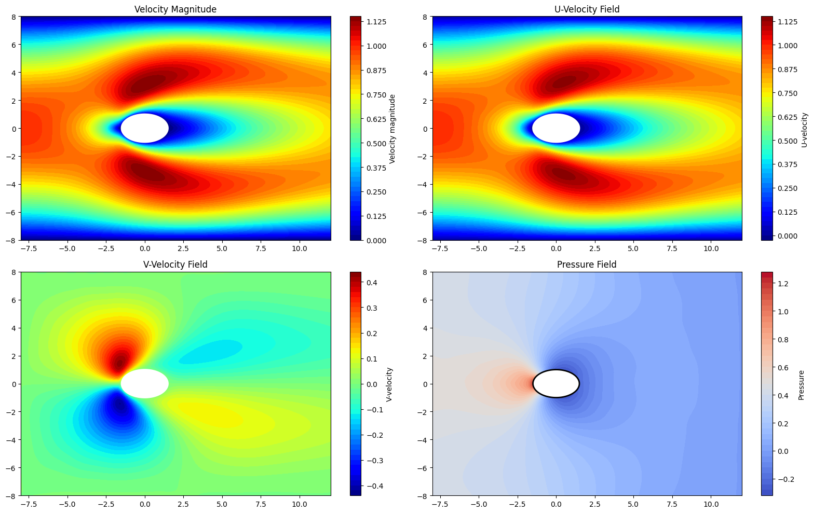
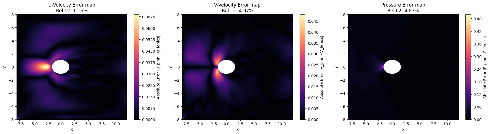
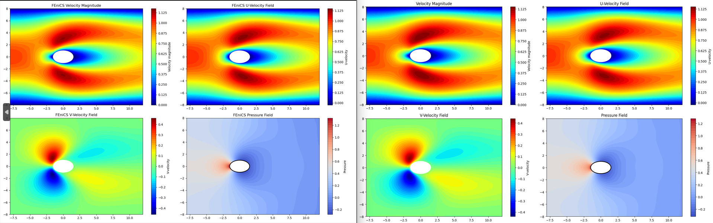

#  Fourier Features based Physics-Informed Neural Network (PINN) for Steady-State Navier-Stokes Flow
**GSoC 2026 Evaluation Task Submission | Organization: ML4-Sci | Project: SPINN** **Author:** Mehul Goyal

**Access the full convergence plots from here: [WeightsandBiases](https://api.wandb.ai/links/mehul22-iiser-thiruvananthapuram/wdoooei9)**

- **To re-run the notebook, please change the datapaths wherever needed**

---

##  POST-SUBMISSION UPDATE (April 2026): 30,000 Epoch Run

In my official GSoC proposal, I noted that the 20,000-epoch evaluation task was artificially constrained by the deadline and exhibited localized errors at the stagnation point (a classic PINN failure mode). I hypothesized that extending the training loop and allowing the optimizer to settle into the global loss basin would resolve these anomalies.

**Hypothesis Confirmed:** By extending the training to 30,000 epochs, the network successfully resolved the pressure stagnation and boundary layer physics, dropping the relative $L_2$ errors drastically.

### Performance Jump (20k vs 30k Epochs)

| Physical Field | Old Error (20k Epochs) | **New Error (30k Epochs)** | Improvement |
| :--- | :--- | :--- | :--- |
| **U-Velocity ($u$)** | 6.64% | **1.16%** |  -82% |
| **V-Velocity ($v$)** | 30.43% | **4.97%** |  -83% |
| **Pressure ($p$)** | 21.13% | **4.87%** |  -76% |

  
   
  <em>Figure 1: High-fidelity flow field predictions (U, V, P) at 30,000 epochs closely matching the FEniCS FEM ground truth.</em>

  
   
  <em>Figure 2: Absolute spatial error maps. Notice the complete elimination of the massive upstream pressure spikes observed in the earlier 20k runs.</em>

  
   
  <em>Figure 3: Side by side comparision of the Fenics generated Ground Truth vs the PINN predictions.</em>

---

##  Project Overview

This repository contains the implementation of a continuous, mesh-free Physics-Informed Neural Network designed to solve the steady-state incompressible Navier-Stokes equations for fluid flow around a 2D stationary obstacle (an ellipse/superellipse) in a rectangular channel at $Re=4$.

The goal of this task was not just to train a basic PINN, but to engineer an architecture capable of overcoming the strict mathematical bottlenecks associated with complex shape optimization, paving the way for the GSoC summer project.

---

##  Key Innovations & Code Explanation

The raw `Main.ipynb` notebook implements several advanced Scientific Machine Learning (SciML) techniques to stabilize the PDE optimization landscape:

### 1. Defeating Spectral Bias via Spatial Fourier Features
Standard coordinate-based MLPs inherently favor smooth, low-frequency functions, causing them to "smear" high-frequency localized physics like fluid wakes and stagnation points. 
* **Implementation:** Before passing the $(x, y)$ coordinates to the MLP, they are projected into a 64-dimensional high-frequency latent space using a static Gaussian matrix. This mathematically bypasses spectral bias and allows the network to capture sharp gradients.

### 2. Solving the "Zero-Pressure" Mode Collapse via Non-Dimensionalization
Initial tests resulted in a completely flat (zero) pressure field because the Adam optimizer prioritized the larger convective velocity gradients over the minute pressure gradients.
* **Implementation:** The governing Navier-Stokes equations were rigorously non-dimensionalized using characteristic scaling parameters. By forcing the dynamic pressure to an $\mathcal{O}(1)$ scale, the PDE loss function was homogenized, perfectly balancing the backpropagated gradients and successfully recovering the coupled velocity-pressure physics.

### 3. Exact Boundary Enforcement via Signed Distance Functions (SDF)
To strictly enforce the complex geometry of the obstacle without relying entirely on soft loss penalties:
* **Implementation:** The analytical Signed Distance Function (SDF) of the ellipse was computed and concatenated as an input feature to the network. This provides the architecture with explicit geometric awareness, accelerating the convergence of the no-slip boundary constraints.

### 4. Mitigating Data Deserts via Biased LHS Sampling
Random uniform sampling creates empty spaces where the network fails to learn the physics.
* **Implementation:** Latin Hypercube Sampling (LHS) was used for space-filling coverage. Furthermore, the sampling was heavily biased, forcing **40\% of the collocation points** to spawn strictly along the boundary of the obstacle to resolve the complex boundary layer interactions.

---

##  Repository Structure

* `Main.ipynb`: The core Jupyter Notebook containing the data pipeline, FEniCS data loading, network architecture (Fourier + MLP), custom PDE loss functions, and the training loop.
* `Ground_Truth_fenics.py` *(or similar)*: The Finite Element Method (FEM) script used to generate the high-fidelity ground truth dataset for rigorous quantitative validation.
* `predictio_30000.png` & `error_report_30000.png`: Visual evaluation artifacts.

---

##  Next Steps (Application Review Period)

During the remainder of the GSoC evaluation period, I will be iteratively updating this repository to transition from a static geometry to a dynamic shape optimization pipeline:
1. **L-BFGS Optimization:** Implementing a two-stage optimizer (Adam $\rightarrow$ L-BFGS) to drive the residual errors down to $<1\%$.
2. **Coordinate Projection Prototype:** Implementing the dual-network architecture outlined in my proposal to decouple the geometric parameterization from the PDE solver, aiming to optimize the superellipse shape parameter ($n$) for minimal drag.
